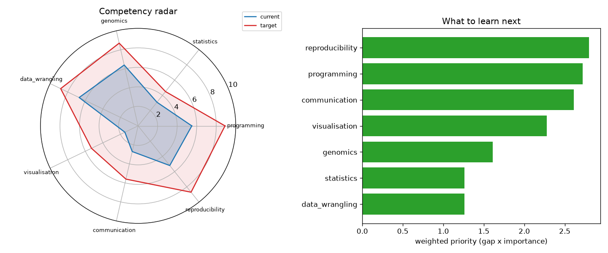

# Bioinformatics Skills Roadmap Tracker

Everyone was a beginner once. The problem is that most beginners have no honest map of where they stand.

This repo is a small, opinionated toolkit for scoring your own bioinformatics competencies across a handful of domains and turning that into a plot you can actually act on. It will not make you a better bioinformatician. It will show you, uncomfortably clearly, what to work on next.

## Demo Output



The figure above was produced from simulated self-assessment data by `demo.py` and shows a competency radar plus a prioritised skill-gap ranking.

## Why This Exists

Career advice in bioinformatics is usually vibes: "learn Python", "do more stats", "read papers". None of that tells you where the biggest return on your limited hours actually is. A crude quantitative model beats vague encouragement, because it forces you to name your weaknesses and rank them.

The idea is simple:

- Rate your current level (0-10) across core competencies.
- Set a target level for the role you want.
- The gap, weighted by how important each competency is to your goal, becomes your priority list.

## The Competencies

| Competency | What it really means |
|---|---|
| programming | Writing scripts others can read and rerun |
| statistics | Knowing when a p-value is lying to you |
| genomics | Understanding the biology behind the matrix |
| data_wrangling | Turning messy files into tidy tables |
| visualisation | Making a plot that answers a question |
| communication | Explaining results to people who pay you |
| reproducibility | Someone else running your code next year |

## When NOT to Use This

- If you already know exactly what to learn next, skip the ceremony and go learn it.
- If you will use the score to feel bad instead of to act, close the tab.
- This is a self-report tool. It measures your perception, not your ability. Calibrate against real feedback.

## Usage

```bash
pip install -r requirements.txt
python skill_tracker.py            # runs on the bundled example profile
python demo.py                     # self-contained demo, writes figures/ and results/
```

Edit the `current` and `target` dictionaries in `skill_tracker.py` with your own honest numbers.

## How The Priority Score Works

For each competency the priority is:

`priority = max(target - current, 0) * importance`

Importance is a weight (0-1) reflecting how much the role you want depends on that skill. A large gap in an unimportant skill scores low; a small gap in a critical skill can outrank it. Sort descending and you have your next quarter's study plan.

## The Uncomfortable Truth

The skill that will advance your career the most is almost never the one you find fun. Most people over-invest in programming polish and under-invest in communication and reproducibility, because the first is comfortable and the second two are exposing. The ranking in this tool tends to surface exactly the things you have been avoiding.

## Further Reading

Inspired by Ming 'Tommy' Tang, "Bioinformatics Career Talk to RSG Pakistan" (https://divingintogeneticsandgenomics.com/talk/2026-rsg-pakistan/).
